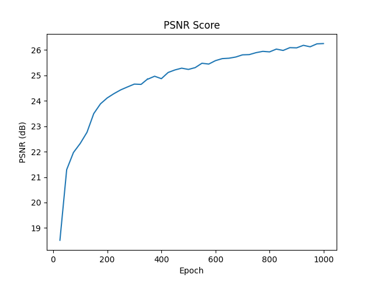
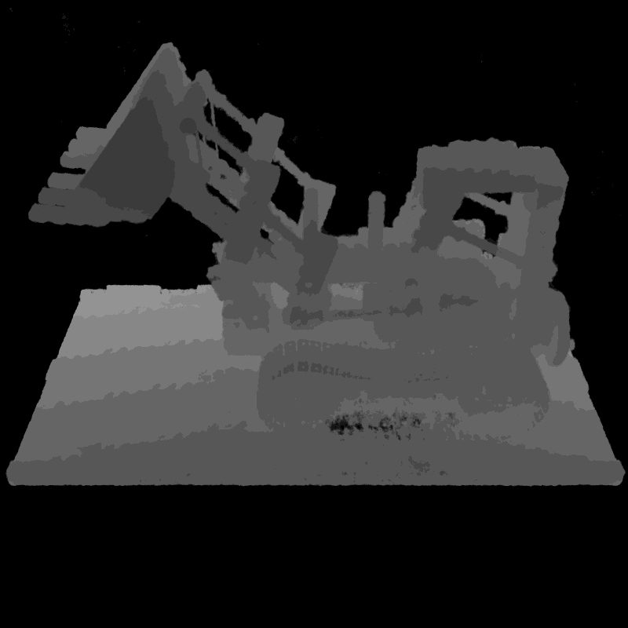
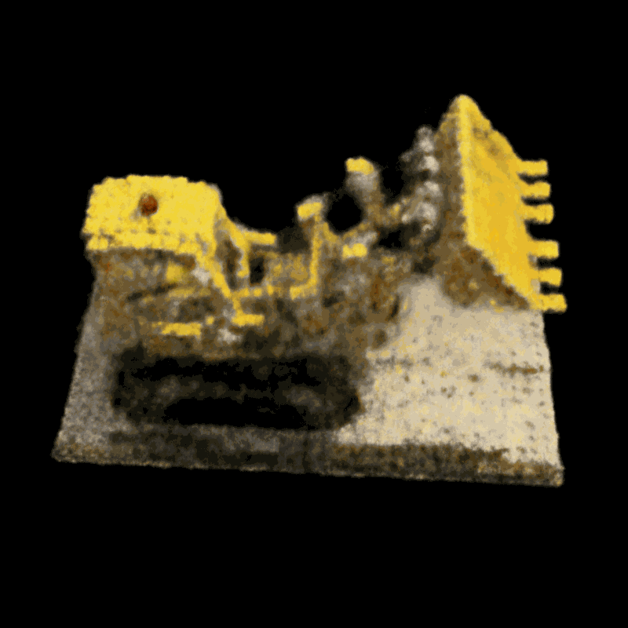
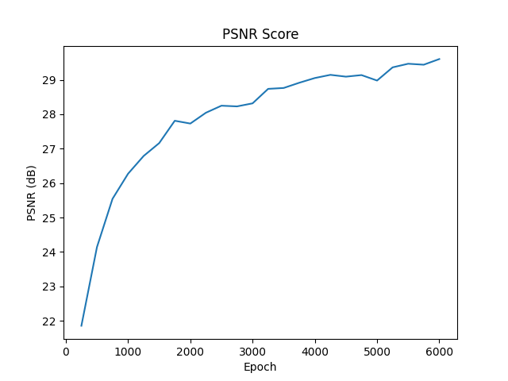

# NGP_from_scratch

This is a pytorch implementation of paper [Instant Neural Graphics Primitives with a Multiresolution Hash Encoding](https://arxiv.org/abs/2201.05989).

If you are good at learning concepts from code, this repo is for you!

The codebase is intentionally simplified to facilitate better understanding of the core concepts with comments showing each tensor's shape which I think makes the code much more readable.

In fact, if you are coming from my previous repo [NeRF_from_scratch](https://github.com/HrushikeshBudhale/NeRF_from_scratch), you will see that this implementation mainly changes just the model.py without changing any ray marching or rendering or training loop. (Try git diff with initial commit)

#### The elegant part about this pytorch implementation is that to make the model work for 2D or 3D demo, you only need to set value of `d` in `conf.yaml` to either 2 or 3 and all functions behave exactly the same.

If you found this repo useful, please leave a star! ⭐️

## Features

- **Multiresolution hash encoding**
- **Accelerated ray marching**
- **Early stopping**
- **(2D) image and (3D) scene reconstruction support**
- SDF reconstruction support (in progress)
- Exponential stepping (to be implemented)

## Installation

1. Clone the repository

    ```bash
    git clone https://github.com/HrushikeshBudhale/NeRF_from_scratch.git
    ```

2. Create conda environment

    ```bash
    conda create -n nerf python=3.10
    conda activate nerf
    ```

3. Install dependencies

    ```bash
    pip install -r requirements.txt
    ```

4. Download dataset

    For 2D image reconstruction you can use [megapixel Tokyo](https://drive.google.com/drive/folders/1blHPr4ZehjzZU7r71Ri9VAEw3VOHr2SL?usp=drive_link) image.
    For 3D scene reconstruction you can use [lego scene](https://drive.google.com/drive/folders/11LHRsKHLTLTP_eV8KYVQ_uB8WFHczonn?usp=drive_link).

5. Set the dataset path and other parameters in `conf.yaml`.

6. Run the code

    ```bash
    python train_nerf.py
    python test_nerf.py
    ```

## Results

### 2D Image Reconstruction

<p align="center">

</p>
<p align="center">
Rendered 2D image from the model (PSNR: 26.12)
</p>
<p align="center">

</p>
<p align="center">
Comparison of ground truth (left) with model's output (right)
</p>
<br>
<p align="center">

</p>
<p align="center">
PSNR score of the model
</p>
</p>

### 3D Scene Reconstruction







## Acknowledgements

- [Instant Neural Graphics Primitives with a Multiresolution Hash Encoding](https://github.com/NVlabs/instant-ngp)
- [NeRF: Representing Scenes as Neural Radiance Fields for View Synthesis](https://github.com/bmild/nerf)
- [torch-ngp](https://github.com/ashawkey/torch-ngp)
